# Hi there, I'm Muhammad Abdullah! 👋

<!-- Theme-Sensitive Header Banner -->
<picture>
  <source media="(prefers-color-scheme: dark)" srcset="readmefile/dark.svg">
  <source media="(prefers-color-scheme: light)" srcset="readmefile/light.svg">
  
</picture>

 

## 🚀 About Me
I'm a **Full-Stack Developer** specializing in the **MERN stack**, with experience building modern, responsive, and user-focused web applications. I work with **React, Next.js, TypeScript, Node.js, Express.js**, and databases to develop practical solutions to real-world problems.

My notable projects include **Orderworker**, a local services marketplace connecting customers with verified professionals, and **Pollify**, an interactive polling platform. I also enjoy contributing to collaborative projects, including a bootcamp learning management system. I am continuously expanding my expertise across modern frontend engineering, backend architecture, UI/UX, and Data Structures & Algorithms (DSA).

> 💡 *"Turning complex problems into simple, scalable, and meaningful solutions."*

- 🌐 **Full-Stack:** Scalable web applications using React, Next.js, Node.js, Express, and REST APIs.
- 🎯 **Current Focus:** Next.js 15, TypeScript, Advanced React, System Design, and building Orderworker.
- 🎓 **Education:** BS Computer Science student at Virtual University of Pakistan.
- 💬 **Ask me about:** MERN Stack development, Next.js architectures, REST APIs, or UI engineering.
- ✉️ **Email:** [abdullahak071@gmail.com](mailto:abdullahak071@gmail.com)
- 💼 **LinkedIn:** [muhammadabdulladev](https://www.linkedin.com/in/muhammadabdulladev)
- 🐙 **GitHub:** [AbdulahBuilds](https://github.com/AbdulahBuilds)

---

## 🛠️ Technical Skills

### 💻 Languages

### 🖥️ Frontend & UI

### ⚙️ Backend & APIs

### 🗄️ Databases & BaaS

### ☁️ DevOps & Tools

---

## 🌟 Featured Projects

| Project | Description | Tech Stack |
| :--- | :--- | :--- |
| [🛠️ **Orderworker**](https://github.com/AbdulahBuilds/abdullah-orderworker) | A service marketplace connecting everyday customers with trusted local professionals. Built for seamless scheduling, job discovery, and service tracking. | Next.js, TypeScript, Tailwind CSS, Node.js, Express, MongoDB |
| [📊 **Pollify**](https://github.com/AbdulahBuilds/Pollify) | An interactive real-time polling application enabling users to create instant polls, collect audience opinions, and visualize voting results live. | React.js, Node.js, Express, Socket.IO, MongoDB |

---

## 📈 GitHub Stats & Metrics

<!-- Contribution activity graph with theme sensitivity -->

  <picture>
    <source media="(prefers-color-scheme: dark)" srcset="https://activity-graph.vercel.app/graph?username=AbdulahBuilds&bg_color=030712&color=94A3B8&line=10B981&point=34D399&area_color=0D9488&area=true&hide_border=true&radius=12">
    <source media="(prefers-color-scheme: light)" srcset="https://activity-graph.vercel.app/graph?username=AbdulahBuilds&bg_color=FFFFFF&color=475569&line=0D9488&point=10B981&area_color=E6FFFA&area=true&hide_border=true&radius=12">
    
  </picture>

<!-- Side-by-Side Stats Cards with theme sensitivity -->

  <!-- GitHub Stats Card -->
  <picture>
    <source media="(prefers-color-scheme: dark)" srcset="https://ghstats.dev/api/card?username=AbdulahBuilds&bg=030712&title_color=10B981&text=94A3B8&icon_color=34D399&border_color=0D9488">
    <source media="(prefers-color-scheme: light)" srcset="https://ghstats.dev/api/card?username=AbdulahBuilds&bg=FFFFFF&title_color=0D9488&text=475569&icon_color=10B981&border_color=E2E8F0">
    
  </picture>
  
  <!-- Top Languages Card -->
  <picture>
    <source media="(prefers-color-scheme: dark)" srcset="https://ghstats.dev/api/langs?username=AbdulahBuilds&layout=grid&bg=030712&title_color=10B981&text=94A3B8&icon_color=34D399&border_color=0D9488">
    <source media="(prefers-color-scheme: light)" srcset="https://ghstats.dev/api/langs?username=AbdulahBuilds&layout=grid&bg=FFFFFF&title_color=0D9488&text=475569&icon_color=10B981&border_color=E2E8F0">
    
  </picture>

<!-- Streak Stats with theme sensitivity -->

  <a href="https://github.com/AbdulahBuilds" target="_blank">
    <picture>
      <source media="(prefers-color-scheme: dark)" srcset="https://streak-stats.demolab.com?user=AbdulahBuilds&theme=dark&background=030712&stroke=0D9488&ring=10B981&fire=34D399&currStreakNum=10B981&currStreakLabel=94A3B8&sideNums=94A3B8&sideLabels=94A3B8&dates=6B7280">
      <source media="(prefers-color-scheme: light)" srcset="https://streak-stats.demolab.com?user=AbdulahBuilds&theme=light&background=FFFFFF&stroke=E2E8F0&ring=0D9488&fire=10B981&currStreakNum=0D9488&currStreakLabel=475569&sideNums=475569&sideLabels=475569&dates=94A3B8">
      
    </picture>
  </a>

---

  ⭐ <b>Feel free to explore my repositories, connect with me, or leave a star!</b> ⭐

---

  Crafted with 💚 by <a href="https://github.com/AbdulahBuilds" target="_blank"><b>Muhammad Abdullah</b></a> 
  Turning complex problems into simple, scalable, and meaningful solutions.

